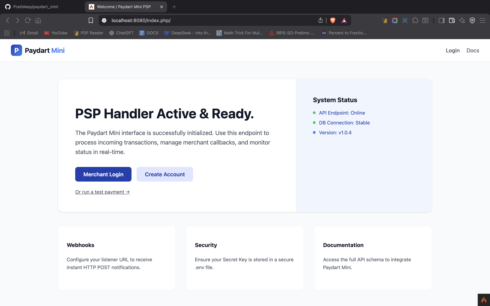
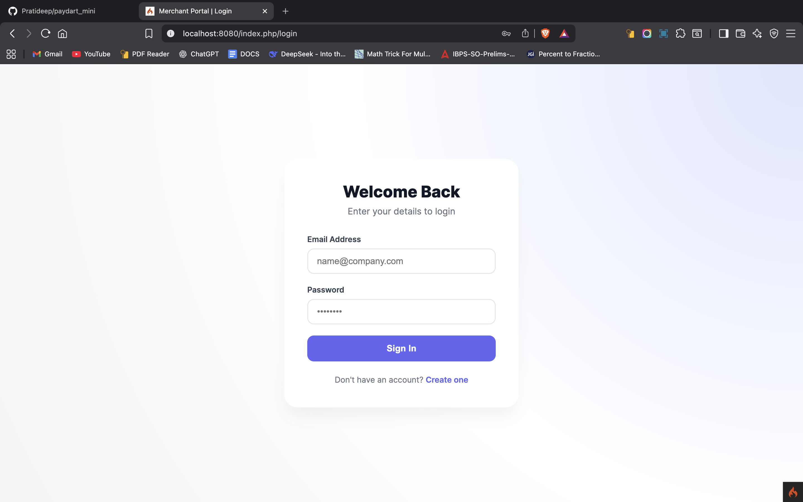
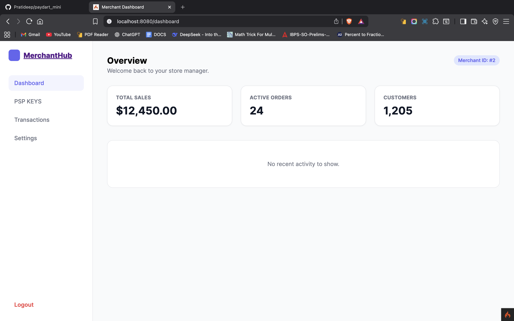
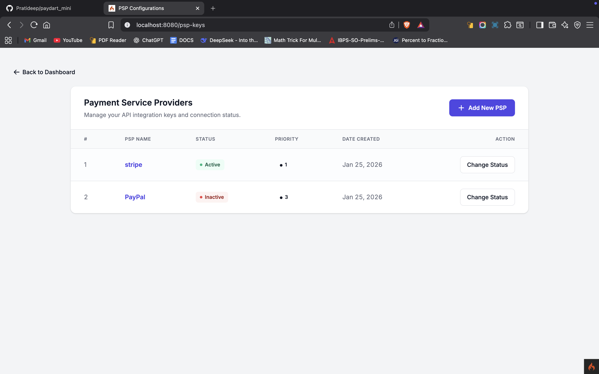
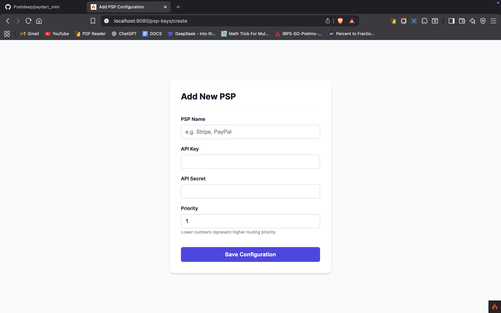
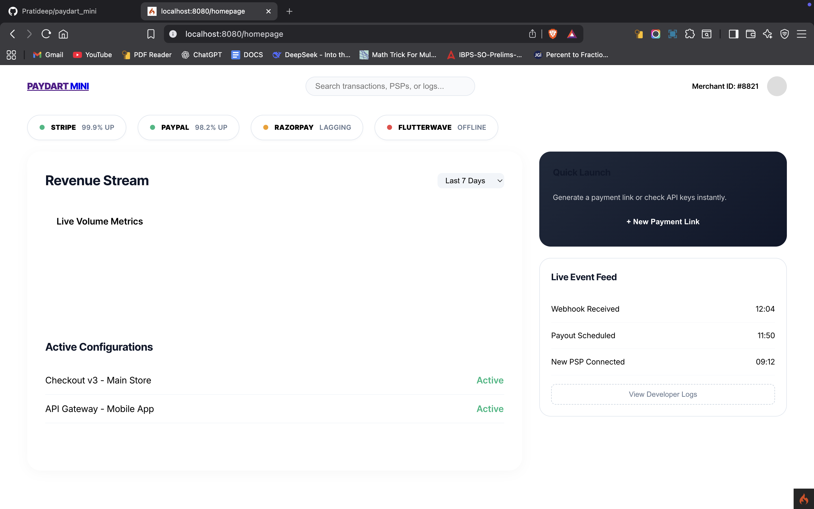

# 💳 Paydart Mini — Multi-PSP Payment Handler & Router

**Paydart Mini** is a **mini payment aggregation system** that demonstrates how modern payment platforms manage **multiple Payment Service Providers (PSPs)** using **priority-based routing**, **secure key management**, and **service separation**.

This project combines:

* **PHP (CodeIgniter 4)** for merchant management & configuration
* **Node.js** for payment routing logic
* A simple **checkout UI** for end-to-end flow simulation

> ⚠️ Educational & portfolio project — **not production-ready for real payments**


## 🧠 System Architecture (High Level)

```
Merchant Panel (PHP)
        │
        │  PSP Configurations
        ▼
Database (MySQL / SQLite)
        │
        │  Active PSP + Priority
        ▼
Payment Router (Node.js)
        │
        ├── PSP 1 (Stripe – mock)
        └── PSP 2 (PayPal – mock)
```


## ✨ Key Features

### 🏪 Merchant Panel (PHP – CodeIgniter 4)

* Merchant authentication (login/register)
* Merchant-specific PSP configuration
* Add / enable / disable PSPs
* Priority-based PSP ordering
* Encrypted API key & secret storage
* Dashboard UI

### 🔑 PSP Management

* Multiple PSP support per merchant
* Status control (`active` / `inactive`)
* Priority routing (lower number = higher priority)
* Secure storage using CI4 Encrypter

### 🔁 Payment Routing (Node.js)

* Fetches active PSPs
* Sorts by priority
* Routes payment request to the correct PSP
* Designed for failover & extension

### 🧾 Checkout Flow

* Simple checkout UI
* Success & failure pages
* Demonstrates real payment flow UX


## 🖥️ Screenshots

## 🖥️ Screenshots

### Landing Page


### Login Page


### Merchant Dashboard


### PSP Configurations


### Add New PSP




## 🧱 Tech Stack

### Backend

* **PHP 8+**
* **CodeIgniter 4**
* **Node.js (Express-style router)**

### Frontend

* HTML, CSS
* Clean admin UI
* Simple checkout pages

### Database

* MySQL / SQLite
* Schema provided


## 📂 Repository Structure

```
paydart-mini/
├── checkout/                 # Checkout UI
│   ├── checkout.html
│   ├── success.html
│   └── fail.html
│
├── database/                 # DB schema
│   ├── schema.sql
│   └── schema.db
│
├── merchant-panel/           # PHP (CodeIgniter 4)
│   ├── app/
│   │   ├── Controllers/
│   │   ├── Models/
│   │   ├── Views/
│   ├── public/
│   ├── writable/
│   ├── composer.json
│   └── README.md
│
├── payment-router/           # Node.js PSP router
│   ├── server.js
│   ├── db.js
│   └── psp/
│       ├── psp1.js
│       └── psp2.js
│
└── index.php                 # Root entry / gateway
```


## 🗄️ Database Schema (Core Table)

```sql
CREATE TABLE psp_configs (
    id INT AUTO_INCREMENT PRIMARY KEY,
    merchant_id INT NOT NULL,
    psp_name VARCHAR(50),
    api_key TEXT,
    api_secret TEXT,
    priority INT DEFAULT 1,
    status ENUM('active','inactive') DEFAULT 'active',
    created_at DATETIME DEFAULT CURRENT_TIMESTAMP
);
```


## ⚙️ Setup Instructions

### 1️⃣ Merchant Panel (PHP)

```bash
cd merchant-panel
composer install
cp env .env
php spark serve
```

Access:

```
http://localhost:8080
```


### 2️⃣ Payment Router (Node.js)

```bash
cd payment-router
npm install
node server.js
```

Runs on:

```
http://localhost:3000
```


### 3️⃣ Checkout UI

Open directly in browser:

```
checkout/checkout.html
```


## 🔄 PSP Routing Logic

```text
1. Receive payment request
2. Fetch merchant PSPs
3. Filter ACTIVE PSPs
4. Sort by priority (ASC)
5. Route to first PSP
6. Return success / failure
```

This mirrors **real PSP aggregators** in simplified form.


## 🔮 Future Enhancements

* [ ] Real payment gateway SDK integration
* [ ] Automatic failover on PSP failure
* [ ] Webhook verification & signing
* [ ] Transaction logs & analytics
* [ ] Admin (platform-level) dashboard
* [ ] REST API for merchants


## 📌 Use Cases

✔ Fintech system design demo
✔ Backend architecture learning
✔ Payment gateway concepts
✔ Resume & interview project
✔ Multi-language backend architecture (PHP + Node)


## ⚠️ Disclaimer

This project **does not process real payments** and is **not PCI-compliant**.
Use strictly for **educational and portfolio purposes**.


## 📜 License

MIT License — free to use, modify, and learn from.


## 👤 Author

**Pratideep Naik**
Backend • Systems • Fintech Enthusiast


